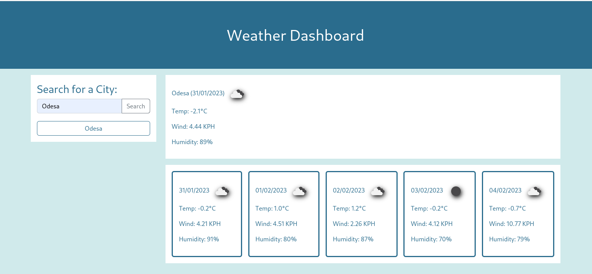

# Module 8 Server-Side APIs: Weather Dashboard

## Description

This Project was created to practice JQuery and work with API's (moment, openweather).
Goal of this Project is to create application where we can search for weather forecast in different cities.
Search history is stored in localstorage.

And at the end we have web-application with search button and input. On button click city name is added to search history and weather forecast is displayed.

> 

## Deployment

The project was deployed to github pages and new version will appear each time changes will be pushed to main branch.

## Link

[Deployed web application](https://marilynwho-weather-app.netlify.app/)

## Credits

N/A

## License

MIT License

Copyright (c) 2022 Viktoriia Chechelnytska

Permission is hereby granted, free of charge, to any person obtaining a copy
of this software and associated documentation files (the "Software"), to deal
in the Software without restriction, including without limitation the rights
to use, copy, modify, merge, publish, distribute, sublicense, and/or sell
copies of the Software, and to permit persons to whom the Software is
furnished to do so, subject to the following conditions:

The above copyright notice and this permission notice shall be included in all
copies or substantial portions of the Software.

THE SOFTWARE IS PROVIDED "AS IS", WITHOUT WARRANTY OF ANY KIND, EXPRESS OR
IMPLIED, INCLUDING BUT NOT LIMITED TO THE WARRANTIES OF MERCHANTABILITY,
FITNESS FOR A PARTICULAR PURPOSE AND NONINFRINGEMENT. IN NO EVENT SHALL THE
AUTHORS OR COPYRIGHT HOLDERS BE LIABLE FOR ANY CLAIM, DAMAGES OR OTHER
LIABILITY, WHETHER IN AN ACTION OF CONTRACT, TORT OR OTHERWISE, ARISING FROM,
OUT OF OR IN CONNECTION WITH THE SOFTWARE OR THE USE OR OTHER DEALINGS IN THE
SOFTWARE.